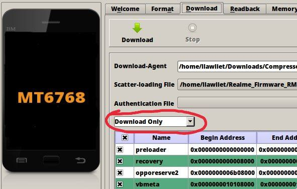

# Unbrick/Downgrade guide for realme Narzo 20/7i(EU)
### >Works on both RUI-1 and RUI-2
## ⏪ Requirements:
### > **PC/Laptop with Linux**

### > **Python: (Execute in Terminal)**
- UBUNTU/DEBIAN:
  - `sudo apt-get install python`
  - `python -m ensurepip –-upgrade`
  - `python3 -m pip install pyusb pyserial json5`
- ARCH/MANJARO:
  - `sudo pacman -S python`
  - `python -m ensurepip –-upgrade`
  - `python3 -m pip install pyusb pyserial json5`
- For any other distro search on Google:
  - After installing python execute:
  - `python -m ensurepip –-upgrade`
  - `python3 -m pip install pyusb pyserial json5`

### > [**SP Flash Tool**](https://spflashtool.com/download/)

### > **libusb: (Execute in Terminal)**
- UBUNTU/DEBIAN:
  - `sudo apt-get install libusb libmtp libmtp-runtime`
- ARCH/MANJARO:
  - `sudo pacman -S libusb libusb-compat libusbmuxd gvfs-mtp libmtp`
- For any other distro search on Google.

### > **libpng: (Execute in Terminal)**
- UBUNTU/DEBIAN:
  - [Download](http://launchpadlibrarian.net/233197129/libpng12-0_1.2.54-1ubuntu1_amd64.deb)
  - Right click on downloaded file > Install
- ARCH/MANJARO:
  -  `sudo pacman -S libpng12`
  -  Execute this in Terminal
- For any other distro search on Google.

### > **Bypass Files:** [**Download**](https://drive.google.com/uc?id=1cIVcoSzGCSeDDxC0Qwv5FeNeJUuruzYu&export=download)

### > **Firmware:** [**RUI-1**](https://caplevi.sayeed.workers.dev/0:/Bot%20Mirror/RMX2191_11_A.23-spft.7z)**/**[**RUI-2**](https://www.mediafire.com/file/du4d4rtheogjqf8/Realme_Firmware_C.18_RMX2193.zip/file)**//**[**RUI-2 Mod**](https://t.me/Realme_Narzo_20/407)

## 📝 Notes:
- Bootloader unlock or lock status doesn't matter (Not applicable for Mod RUI-2).

- For RUI-2: After flashing RUI 2.0 it will boot till realme UI yellow logo once then it will suck at realme's white logo. Don't do anything stay there at least for 20 minutes, it will boot to recovery mode. Do format data enter that code thing > Ok.

- Join group of any kind of support: [Click Here](https://telegram.dog/realme_narzo_20_group)
## ⚠️ Warning:
- **Please make sure it is in _download only_ mode otherwise be ready to buy new motherboard.**



- **Modded RUI-2 won't work in locked bootloader and don't try to lock bootloader after flashing it.**
## ⏩ Procedure:
1. Extract Bypass.zip

2. Power off your device // Incase it’s bricked or at
bootloop continue to next step.

3. Go to Bypass Folder

4. Right Click > Open Terminal Here

5. Execute `./brom.sh`

6. Press and Hold both volume buttons and connect your
device to PC through USB Cable. (Incase it’s in Bricked or
at bootloop Hold all 3 buttons.)

7. Output should be “Protection Disabled”. If not install
lib usb properly and try again.

8. You can release volume buttons now.

9. Open Terminal, Execute these commands one by one:
- `su` (Enter your root password after that)
- `touch /etc/udev/rules.d/80-persistent-usb.rules`
```
echo "SUBSYSTEM=="usb", ACTION=="add", ATTR{idVendor}=="0e8d", ATTR{idProduct}=="*"" >> /etc/udev/rules.d/80-persistent-usb.rules
```
- `touch /etc/udev/rules.d/20-mm-blacklist-mtk.rules`
```
echo "ATTRS{idVendor}=="0e8d", ENV{ID_MM_DEVICE_IGNORE}="1"" >> /etc/udev/rules.d/20-mm-blacklist-mtk.rules
```
```
echo "ATTRS{idVendor}=="6000", ENV{ID_MM_DEVICE_IGNORE}="1"" >> /etc/udev/rules.d/20-mm-blacklist-mtk.rules
```

10. Now Extract SP Flash Tool Zip.

11. Open SP Flash Tool Folder.

12. Right Click > Open Terminal Here

13. Execute `chmod +x flash_tool`

14. Execute `su`, enter your password then execute `./flash_tool.sh`

15. Extract Firmware

16. Select scatter file from ofp/MT6768_Android_scatter.txt

17. Untick these partitions if you don't want OTA updates (optional):
- Opporeserve2
- Special preload
- My custom
- Cdt engineering 

18. Now Go to Options in SP Flash Tool (Top Left) Then connection, Select UART and Set Baud rate to *921600*

19. Make sure it is on “Download Only” Mode otherwise be ready to buy new motherboard.

20. Click on Green Download Button (If any error comes repeat step 18 again).

21. Green Check Mark will Appear after flashing done.

22. Remove Cable wait 10 Sec then reboot.

23. Enjoy!!

### 👤 Credits ~
- Jash Gro for original guide.
- Bjoern Kerler for his tool.
- Anestis Bechtsoudis for simg2img.
- Eternal for helping.
