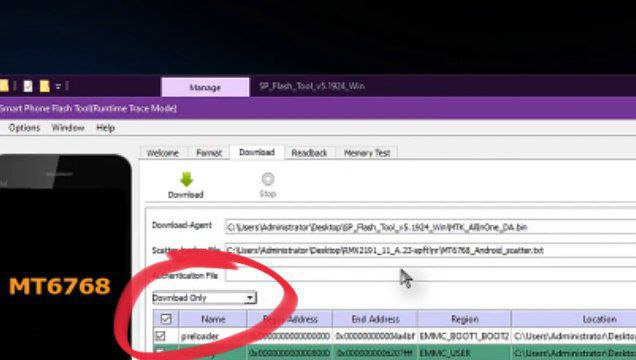
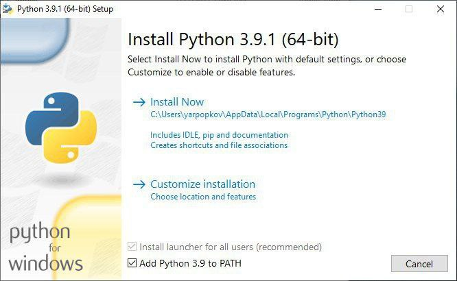
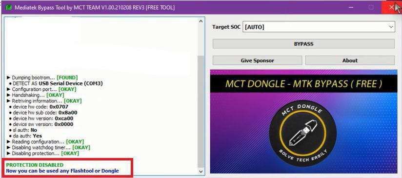
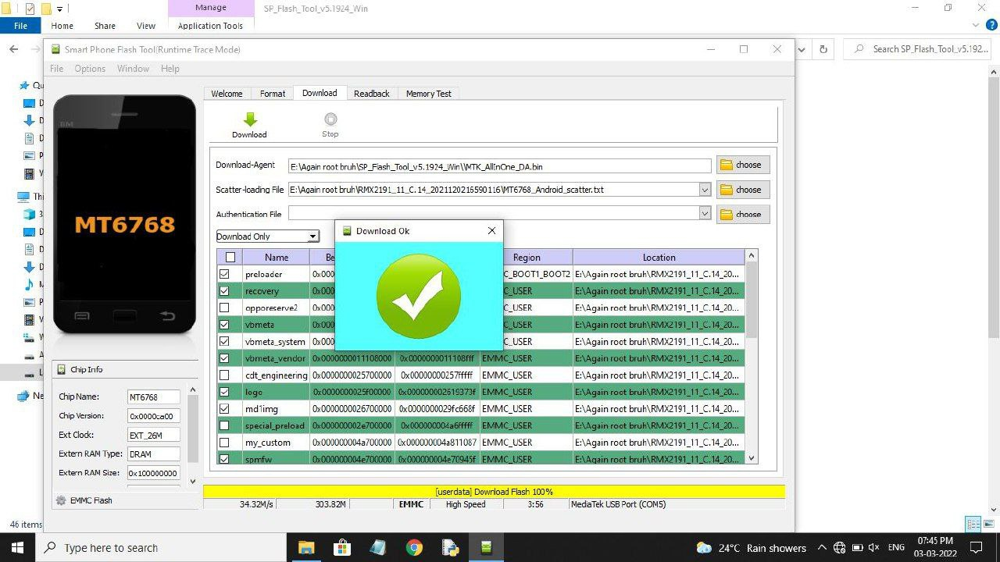

# Unbrick/Downgrade guide for realme Narzo 20/7i(EU)
### >Works on both RUI-1 and RUI-2
## ⏪ Requirements:
> PC/Laptop

> [Bypass tool + libusb](https://www.mediafire.com/file/20xsc7k564iklor/libusb_and_MTK_bypass.zip/file)

> [Python](https://www.python.org/downloads/release/python-3110/)

> [SP Flash Tool](https://spflashtool.com/download/)

> Firmware: [RUI-1](https://caplevi.sayeed.workers.dev/0:/Bot%20Mirror/RMX2191_11_A.23-spft.7z)/[RUI-2](https://www.mediafire.com/file/du4d4rtheogjqf8/Realme_Firmware_C.18_RMX2193.zip/file)//[RUI-2 Mod](https://t.me/Realme_Narzo_20/407)
## 📝 Notes:
- Bootloader unlock or lock status doesn't matter (Not applicable for Mod RUI-2).

- For RUI-2: After flashing RUI 2.0 it will boot till realme UI yellow logo once then it will suck at realme's white logo. Don't do anything stay there at least for 20 minutes, it will boot to recovery mode. Do format data enter that code thing > Ok.

- Join group of any kind of support: [Click Here](https://telegram.dog/realme_narzo_20_group)
## ⚠️ Warning:
- **Please make sure it is in _download only_ mode otherwise be ready to buy new motherboard.**

- **Modded RUI-2 won't work in locked bootloader and don't try to lock bootloader after flashing it.**
## ⏩ Procedure:
1. Run Python Installer (Tick add python to path).

2. Install libusb and Launch tool named mtk_bypass_rev4.exe (turn off realtime protection if it is getting detected as a Virus).

3. Power off your device. // In case it is bricked (or at bootloop) proceed to next step.

4. Press Bypass button in tool, Hold both volume buttons and connect your device to PC with a USB Cable. (If it's bricked or at bootloop, Hold all 3 buttons together until bypass is done.
Output should be like this:

5. You can release volume buttons now.

6. Now extract SP Flash Tool zip and run FlashTool.exe

7. Extract firmware, Select scatter file in SP Flash Tool from extracted firmware. (MT6768_Android_Scatter.txt)

8. Untick these partitions if you don't want OTA updates (optional):
- Opporeserve2
- Special preload
- My custom
- Cdt engineering

9. Please make sure it is in "Download Only" mode else be ready to buy new motherboard.

10. Press Green Download Button.

11. After flashing a "Green Checkmark" will appear like this:

12. Remove USB Cable, wait 10 seconds and hold power button.

13. Enjoy!!

### 👤 Credits ~
- Jash Gro for original guide.
- Bjoern Kerler for his tool.
- Anestis Bechtsoudis for simg2img.
- Eternal for helping.
